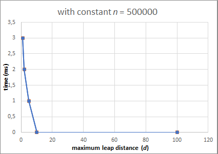
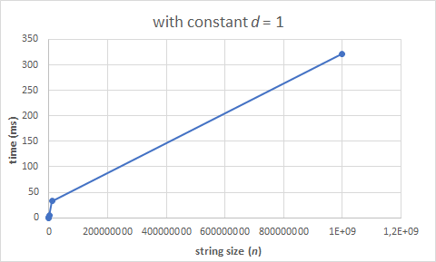
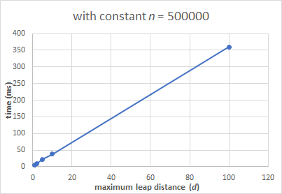
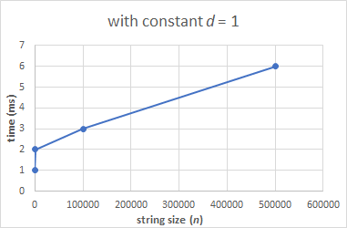
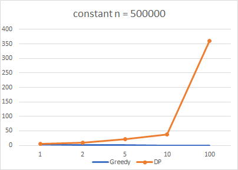

# Problem solving comparison for [910 A](https://codeforces.com/contest/910/problem/A) using Greedy and DP  
This repo will solve the Codeforces problem [The Way to Home](https://codeforces.com/problemset/problem/910/A) using Greedy and Dynamic Programming. We will compare both solutions to see which one is more optimal.

### Team Member
- Calvin Joe Dennedy
- Farrell Nathaniel
- Grand Marcell
- Klemens Wiyanto

### Language
- C++ 14

## Problem Summary 
A frog is trying to reach home from point 1 to *n*. The frog can jump on *d* distance, on points that has lilies on it. There are always lilies somewhere in point 1 to *n*.

The problem needs us to find the minimum amount of jumps she needs to do in order to get home from point 1. If the next lily point is less than the jump distance, print -1.

## Input/Output
**Sample #1**  
Input:
```
8 4
10010101
```
Output:
```
2
```

---
**Sample #2**  
Input:
```
4 2
1001
```
Output:
```
-1
```

##### Note  
In the first example the frog can reach home in two jumps: the first jump from the point 1 to the point 4 (the length of the jump is three), and the second jump from the point 4 to the point 8 (the length of the jump is four).

In the second example the frog can not reach home, because to make it she need to jump on a distance three, but the maximum length of her jump equals to two.

## Explanation on both Solutions  
#### Greedy Solution:  
The greedy way of this problem starts by first checking the maxleap and then look back and see where is the closest lily flower. Set that closest stepping stone as the current standing point. Repeat by checking from the maxleap and jump to the first lily flower that we meet (which means the farthest stone from our current standing point).

```
while(i<goal-1){
```
A *while* loop to repeat the algorithm until we reach the goal. Inside the *while* loop, we have
```
 for(j=i; j>i-maxleap; j--){
      if (track[j] == '1'){
              break;
            }
        }
```
a *for* loop that finds the farthest lily flower the frog can step on, not from 1, but from the max jump distance point to find the lily flower quicker.
```
            |
            v start from this zero, and go backwards from there
1  0  0  1  0  1  0  1
           i/j          is the max distance the frog can jump from starting 1
         j              walks back one step from the i/j
          <--  goes to the left direction
               instead of checking the farthest lily flower from the beginning 1, it starts from the  
               middle (i/j) and finds the first 1 it encounters
```
In the example, *track[j]* should be triggered and breaks out of the *for* loop.

After this, there is a simple *if* statement to check if there is no lily flowers between *j* and *i* (including the *i*)
```
if (j==i-maxleap) {
    cout << -1;
        return 0;
```
which will instantly end the program as the frog will not be able to leap across the distance to the next lily flower, and the program will print -1 and end instantly.

But if the above if is not fulfilled, it will skip to the last statement, which is to move the *i* to the next position in the string and add 1 to the ans counter to count the amount of leaps the frog did in the the whole program. 
```
i=j+maxleap;
ans++;
```        
Notice that when the *i* reaches the end or beyond the goal, the final leap is not added to the *ans* counter. This is because the final leap is added to the counter in the final *if* statement that checks whether the *i* has reached the goal yet.

Finally, the *ans* is printed.

Complexity: Worst Case: O(nd),  
*n* being the amount of string characters and *d* being the max distance of the frog's leap.

#### Dynamic Programming Solution:  
The dynamic programming way of this problem is by storing where you will land in the last leap, by creating a small table about our current location in the leap, and keep counting how many we leap by array.

```
1 1 1 0 0 1 0 1
0 ~ ~ ~ ~ ~ ~ ~
0 1 ~ ~ ~ ~ ~ ~
0 1 1 ~ ~ ~ ~ ~
0 1 1 ~ ~ 2 ~ ~
0 1 1 ~ ~ 2 ~ 3
```
For the first leap, we go through every possible step within the maximum leap, and storing it at the same time. Then we select the farthest *1*. From the farthest *1*, we'll do our first leap, written as 1 in the table above. After placing our position, we also count it as our amount of steps. After placing it, we start counting the steps for our next leap, and place our position in the farthest position while updating our amount of steps. Once we reach the end, the first for loop breaks and we print the amount of leaps we did in the string. If not, print -1.

Complexity: Worst Case: O(nd)

### Comparison
#### In Greedy
##### With constant *n* input
```     
n    |         500000           |
d    | 1 |  2  |  5  | 10 | 100 |
time | 3 |  2  |  1  |  0 |  0  | (in ms)
```
  
The higher the jump distance, the faster the frog can get to the end.

I had to change the *n* to 500000 to make a fair comparison with DP. But the original 5000000 (which has more noticable graph difference) can still be seen [here.](https://raw.githubusercontent.com/AAlab1819/ProjectTeam03-B/master/graph-pics/greedy-constantNfixed.png)
##### With constant *d* input
```
n    | 100 | 1000 | 1000000 | 10000000 | 1000000000 |
d    |                 1                            |
time |  0  |   1  |    4    |    33    |    322     | (in ms)
```
  
The longer the string size, the longer it takes to get to the end.
#### In Dynamic Programming
##### With constant *n* input
```
n    |        500000          |
d    | 1 |  2 |  5 | 10 | 100 |
time | 6 | 10 | 22 | 38 | 360 | (in ms)
```
  
The program ran slower than Greedy, and even more slower the higher max distance leap we input.
Notice how the graph goes upwards instead of downwards in Greedy's section above.
##### With constant *d* input
```
n    | 100 | 1000 | 100000 | 500000 |
d    |             1                |
time |  1  |  2   |   3    |   6    | (in ms)
```
  
Sadly we can't do a closer comparison on *d* input because of the program's limitations with DP. But it can also be seen that it's slower than Greedy, though not by a wide margin.
### Analysis 
###### Picture comparison of Greedy vs DP with constant *n*


Our program has two input factors: the string size, and the maximum jump distance (*n* and *d*, respectively). These two can individually affect how fast the program runs. That is why I put two graphs on each solution showing how each input affects the process time.

Greedy easily won because of how quicker the program runs on almost any aspect. Then again, the differences aren't noticable unless we go millions with the inputs, which is 10000x of the original test cases on Codeforces.
